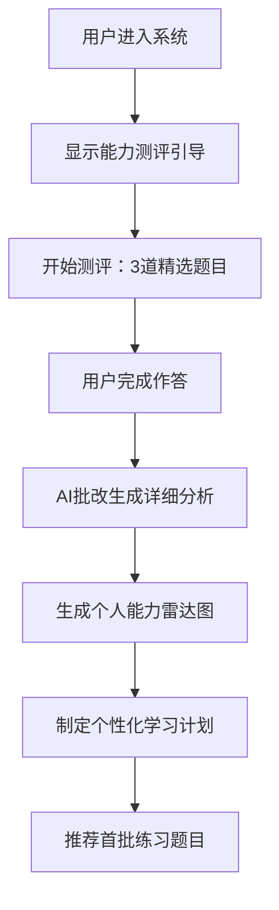

# 第一阶段：个性化学习引擎设计文档

## 🎯 项目目标

将现有的"申论批改工具"升级为"AI申论教练"，通过智能诊断用户能力水平，提供个性化学习路径和针对性训练建议。

---

## 🧠 核心功能设计

### 1. 智能能力测评系统

#### 1.1 测评流程设计


#### 1.2 测评题目选择标准
- **题目1**：综合分析类（测试审题拆解+逻辑重构能力）
- **题目2**：对策建议类（测试搜寻组件+规范作答能力）  
- **题目3**：应用文写作（测试格式规范+语言表达能力）

#### 1.3 能力维度评估
基于现有的四维批改体系，扩展为六维能力模型：

```javascript
const abilityDimensions = {
  审题拆解: { weight: 20, description: "理解题目要求，提取关键信息" },
  搜寻组件: { weight: 20, description: "从材料中检索有效论据" },
  逻辑重构: { weight: 25, description: "构建清晰的论证结构" },
  规范作答: { weight: 15, description: "语言表达和格式规范" },
  创新思维: { weight: 10, description: "观点新颖度和深度" },
  时间管理: { weight: 10, description: "答题效率和完成度" }
}
```

### 2. 个人能力档案系统

#### 2.1 数据库设计
```sql
-- 用户能力档案表
CREATE TABLE user_ability_profile (
    id UUID PRIMARY KEY,
    user_id UUID NOT NULL,
    assessment_date TIMESTAMP,
    overall_score DECIMAL(5,2),
    ability_scores JSONB, -- 六维能力得分
    strengths TEXT[], -- 优势能力
    weaknesses TEXT[], -- 薄弱环节
    learning_style VARCHAR(50), -- 学习风格：视觉型/听觉型/动觉型
    target_score INTEGER, -- 目标分数
    estimated_study_weeks INTEGER, -- 预计学习周数
    created_at TIMESTAMP DEFAULT NOW()
);

-- 学习路径规划表
CREATE TABLE learning_path (
    id UUID PRIMARY KEY,
    user_id UUID NOT NULL,
    current_level VARCHAR(20), -- 初级/中级/高级
    focus_areas TEXT[], -- 重点提升领域
    recommended_questions JSONB, -- 推荐题目ID列表
    daily_practice_count INTEGER, -- 每日练习量
    weekly_goals TEXT,
    created_at TIMESTAMP DEFAULT NOW(),
    updated_at TIMESTAMP DEFAULT NOW()
);
```

#### 2.2 能力雷达图生成
```javascript
// 前端雷达图配置
const radarConfig = {
  type: 'radar',
  data: {
    labels: ['审题拆解', '搜寻组件', '逻辑重构', '规范作答', '创新思维', '时间管理'],
    datasets: [{
      label: '当前能力',
      data: userAbilityScores,
      borderColor: 'rgb(59, 130, 246)',
      backgroundColor: 'rgba(59, 130, 246, 0.2)'
    }, {
      label: '目标能力',
      data: targetScores,
      borderColor: 'rgb(16, 185, 129)',
      backgroundColor: 'rgba(16, 185, 129, 0.2)'
    }]
  },
  options: {
    scales: {
      r: {
        min: 0,
        max: 100,
        ticks: { stepSize: 20 }
      }
    }
  }
}
```

### 3. 智能学习路径规划

#### 3.1 用户分级策略
```javascript
const userLevels = {
  初学者: { scoreRange: [0, 50], focusOn: ['基础审题', '规范表达'] },
  进阶者: { scoreRange: [51, 75], focusOn: ['逻辑结构', '论据搜集'] },
  熟练者: { scoreRange: [76, 85], focusOn: ['创新思维', '高效答题'] },
  专家级: { scoreRange: [86, 100], focusOn: ['综合提升', '模考冲刺'] }
}
```

#### 3.2 个性化推题算法
```python
def generate_personalized_questions(user_profile):
    """
    基于用户能力档案生成个性化题目推荐
    """
    weak_areas = user_profile.weaknesses
    current_level = user_profile.current_level
    practice_history = get_user_practice_history(user_profile.user_id)
    
    # 权重计算
    weights = {
        'weakness_focus': 0.4,  # 针对薄弱环节
        'level_appropriate': 0.3,  # 适合当前水平
        'variety_balance': 0.2,   # 题型均衡
        'progressive_difficulty': 0.1  # 循序渐进
    }
    
    # 从题库中筛选匹配题目
    candidate_questions = filter_questions_by_criteria(
        weak_areas=weak_areas,
        difficulty_level=current_level,
        exclude_recent=practice_history[-10:]  # 排除最近练过的
    )
    
    # 排序推荐
    recommended = rank_questions(candidate_questions, weights)
    
    return recommended[:5]  # 返回前5道推荐题目
```

### 4. 进步追踪与可视化

#### 4.1 学习数据收集
```javascript
// 每次练习后记录的数据
const practiceRecord = {
  questionId: 'uuid',
  submittedAt: 'timestamp',
  timeSpent: 'seconds',
  scores: {
    overall: 75,
    dimensions: {
      审题拆解: 18,
      搜寻组件: 20,
      逻辑重构: 22,
      规范作答: 15
    }
  },
  improvements: [], // AI识别的具体改进点
  difficulty: 'medium',
  questionType: '综合分析类'
}
```

#### 4.2 进步可视化设计
- **能力成长曲线**：展示各维度能力随时间变化
- **练习统计面板**：今日/本周/本月练习量和得分
- **薄弱点跟踪**：重点关注区域的改善情况
- **目标达成进度**：距离目标分数的剩余差距

---

## 🛠 技术实现方案

### 后端API设计

#### 评估相关接口
```typescript
// 1. 获取能力测评题目
GET /api/v1/assessment/questions
Response: {
  questions: [
    {
      id: "uuid",
      type: "综合分析",
      title: "测评题目1",
      content: "...",
      estimatedTime: 25 // 分钟
    }
  ]
}

// 2. 提交测评答案
POST /api/v1/assessment/submit
Request: {
  answers: [
    { questionId: "uuid", content: "答案内容", timeSpent: 1500 }
  ]
}
Response: {
  profileId: "uuid",
  overallScore: 68.5,
  abilityScores: {...},
  analysis: "个性化分析报告"
}

// 3. 获取学习路径推荐
GET /api/v1/learning-path/{userId}
Response: {
  currentLevel: "进阶者",
  focusAreas: ["逻辑重构", "搜寻组件"],
  recommendedQuestions: [...],
  studyPlan: {...}
}
```

### 前端页面设计

#### 1. 能力测评页面 (`/assessment`)
```jsx
const AssessmentPage = () => {
  const [currentQuestion, setCurrentQuestion] = useState(0);
  const [answers, setAnswers] = useState([]);
  const [timeSpent, setTimeSpent] = useState(0);
  
  return (
    <div className="assessment-container">
      <ProgressBar current={currentQuestion + 1} total={3} />
      <QuestionCard 
        question={questions[currentQuestion]}
        onAnswer={handleAnswer}
        onNext={handleNext}
      />
      <Timer onTick={setTimeSpent} />
    </div>
  );
};
```

#### 2. 能力档案页面 (`/profile`)
```jsx
const AbilityProfile = ({ userProfile }) => {
  return (
    <div className="grid grid-cols-1 lg:grid-cols-2 gap-6">
      {/* 能力雷达图 */}
      <Card>
        <h3>能力分析雷达图</h3>
        <RadarChart data={userProfile.abilityScores} />
      </Card>
      
      {/* 优势与薄弱点 */}
      <Card>
        <h3>能力评估</h3>
        <StrengthsWeaknesses 
          strengths={userProfile.strengths}
          weaknesses={userProfile.weaknesses}
        />
      </Card>
      
      {/* 学习建议 */}
      <Card className="lg:col-span-2">
        <h3>个性化学习建议</h3>
        <StudyRecommendations recommendations={userProfile.studyPlan} />
      </Card>
    </div>
  );
};
```

#### 3. 智能练习页面 (`/practice`)
```jsx
const SmartPractice = () => {
  const { recommendedQuestions } = useRecommendations();
  
  return (
    <div className="practice-dashboard">
      <div className="mb-6">
        <h2>今日推荐练习</h2>
        <p className="text-gray-600">
          基于您的能力档案，为您推荐以下题目：
        </p>
      </div>
      
      <QuestionList 
        questions={recommendedQuestions}
        onSelect={startPractice}
        showDifficulty={true}
        showFocusArea={true}
      />
      
      <div className="mt-8">
        <ProgressStats />
      </div>
    </div>
  );
};
```

---

## 📊 数据分析与AI算法

### 1. 用户画像构建
```python
class UserPersona:
    def __init__(self, user_id):
        self.user_id = user_id
        self.learning_style = self.detect_learning_style()
        self.progress_pattern = self.analyze_progress_pattern()
        self.optimal_difficulty = self.calculate_optimal_difficulty()
    
    def detect_learning_style(self):
        # 基于用户行为数据判断学习风格
        # 快速完成 vs 深度思考
        # 频繁练习 vs 集中突破
        pass
    
    def recommend_study_schedule(self):
        # 基于用户画像推荐学习计划
        pass
```

### 2. 难度自适应算法
```python
def adaptive_difficulty(user_ability, recent_performance):
    """
    动态调整题目难度的算法
    """
    if recent_performance['accuracy'] > 0.8:
        # 连续答对，提升难度
        return min(user_ability['level'] + 1, 5)
    elif recent_performance['accuracy'] < 0.5:
        # 频繁答错，降低难度
        return max(user_ability['level'] - 1, 1)
    else:
        # 维持当前难度
        return user_ability['level']
```

---

## 🚀 开发计划与里程碑

### Week 1-2: 基础架构
- [ ] 数据库表结构设计与创建
- [ ] 基础API接口开发
- [ ] 前端页面框架搭建

### Week 3-4: 核心功能
- [ ] 能力测评系统实现
- [ ] AI批改结果解析与能力评估
- [ ] 雷达图和可视化组件

### Week 5-6: 智能推荐
- [ ] 推题算法实现
- [ ] 学习路径规划逻辑
- [ ] 个性化推荐页面

### Week 7-8: 完善与测试
- [ ] 用户界面优化
- [ ] 功能测试与Bug修复
- [ ] 性能优化和部署

---

## 💡 成功指标

### 用户体验指标
- 测评完成率 > 80%
- 用户留存率（7天）> 60%
- 平均每用户练习题数 > 10道/周

### 功能效果指标
- 推荐题目匹配度 > 85%（用户反馈）
- 能力提升检测准确率 > 75%
- 学习计划完成度 > 50%

### 技术性能指标
- 测评结果生成时间 < 30秒
- 推荐算法响应时间 < 2秒
- 系统可用性 > 99.5%

---

## 🎯 下一步行动

1. **确认设计方案**：Review 本文档，确认核心功能和技术选型
2. **细化数据库设计**：完善表结构和关系设计
3. **开发原型界面**：先实现核心页面的UI框架
4. **实现测评功能**：从能力测评开始，逐步迭代

**需要我开始实现其中的某个具体功能吗？比如先做能力测评的数据库设计或者前端界面？**

